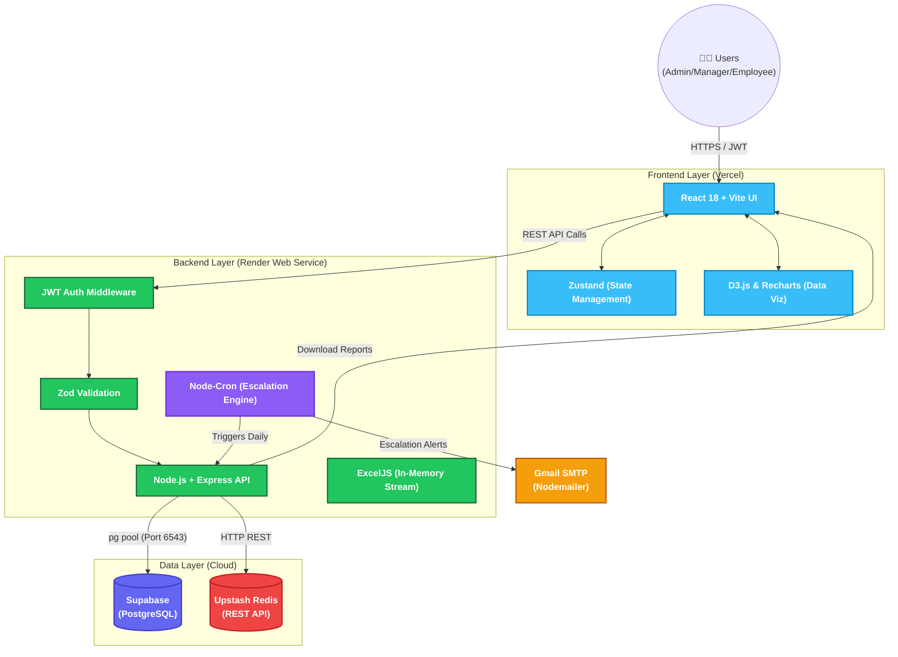

# CoreSync — Hackathon Submission Details

## 1. Live Hosted Demo URL
**[Insert Your Vercel URL Here]** *(e.g., https://coresync.vercel.app)*

## 2. Source Code Repository
**[https://github.com/Sujalgabhane/CoreSync](https://github.com/Sujalgabhane/CoreSync)**

## 3. Architecture Diagram
*(You can view this diagram on GitHub, or copy the code block below into [Mermaid Live Editor](https://mermaid.live/) to instantly download it as a PNG or PDF!)*

## 4. Role-Based Login Credentials
*Our login page features "Demo Credentials" buttons that automatically fill these in so you don't have to type them!*

| Role | Email | Password | What to evaluate |
|------|-------|----------|------------------|
| **Admin** | `admin@align.demo` | `Admin@123` | D3.js Cascade Tree, Analytics Charts, Escalation Logs, Audit Trail, Excel Export |
| **Manager** | `manager1@align.demo` | `Manager@123` | Approving/Returning goals, Team Momentum Dashboard, Check-in Reviews |
| **Employee** | `emp1@align.demo` | `Employee@123` | Creating goals, live 100% weightage validation, logging quarterly achievements |
